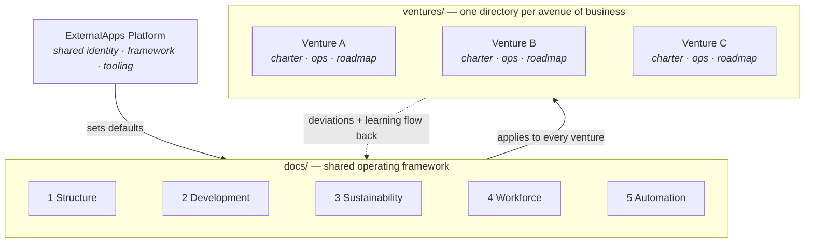
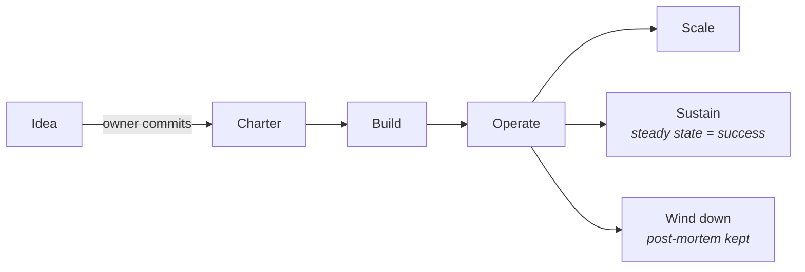

# ExternalApps — Multi-Venture Business Platform

ExternalApps is the organizing platform for multiple avenues of business. It gives every
venture a common home and a shared operating framework, so each one can grow on its own
terms while drawing on the same structure, development practices, sustainability
principles, workforce model, and automation tooling.

## The structure at a glance



Every venture moves through the same lifecycle, with three honest end-states:



New avenues enter through the [opportunity scoring model](docs/06-opportunity-scoring.md) —
candidates are ranked on eight weighted factors (profitability and automation
potential heaviest, simplicity next) in [`research/opportunities.md`](research/opportunities.md),
and the platform console provides an interactive dashboard for scores, venture
status, progress, and financials — in a [monitor interface](console/index.html)
and a [phone interface](console/mobile.html) that share the same data.

## How this repository is organized

```
ExternalApps/
├── docs/                    Shared operating framework (applies to every venture)
│   ├── 00-platform-overview.md
│   ├── 01-business-structure.md
│   ├── 02-development.md
│   ├── 03-sustainability.md
│   ├── 04-workforce.md
│   ├── 05-automation.md
│   └── 06-opportunity-scoring.md
├── research/                Opportunity research — scored candidate businesses
│   └── opportunities.md
├── management/              Business-level governance and tracking
│   ├── README.md            Teams, ownership (BC sole proprietorship), succession
│   ├── status.md            Executive summary + status board
│   ├── business-registration.md   BC registration + succession checklist
│   ├── naming-and-domains.md      Name candidates, domain, email & web plan
│   └── projects/            Project register + one-pager template
├── console/                 Interactive platform console (two interfaces, shared data)
│   ├── index.html           Monitor interface — sidebar layout, tables, charts
│   └── mobile.html          Phone interface — bottom nav, card lists, touch-first
└── ventures/                One directory per avenue of business
    ├── README.md            Venture registry — the live index of all ventures
    └── _template/           Copy this to start a new venture
        ├── README.md        Venture charter
        ├── operations.md    Structure, workforce, and automation for this venture
        └── roadmap.md       Development and sustainability plan
```

## The five pillars

Every venture on the platform is organized around the same five pillars:

1. **Structure** — how the venture is set up: ownership, roles, decision-making,
   and how it relates to the platform and other ventures.
2. **Development** — how the venture grows: product/service development, market
   development, and the stages it moves through from idea to steady state.
3. **Sustainability** — what keeps it viable long-term: financial durability,
   environmental responsibility, and resilience to change.
4. **Workforce** — the people: what work needs humans, how they're organized,
   how they grow, and how the venture treats them.
5. **Automation** — the machines: what work is automated, what tools and systems
   carry it, and how automation and workforce complement each other.

The pillars are documented once, at the platform level, in [`docs/`](docs/). Each
venture then applies them to its own situation in its own directory under
[`ventures/`](ventures/).

## Starting a new venture

1. Copy `ventures/_template/` to `ventures/<venture-name>/`.
2. Fill in the charter (`README.md`), `operations.md`, and `roadmap.md`.
3. Add the venture to the registry in `ventures/README.md`.
